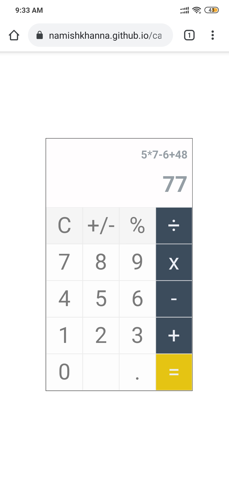

# Calculator
Calculator using HTML, CSS and JavaScript.

 

## Hosted Link:-
https://namishkhanna.github.io/calculator_using_html/

 

## Calculator:- PC/Laptop View

 

## Calculator:- Mobile View

 

## Calculator:- Mobile View in PC/Laptop

